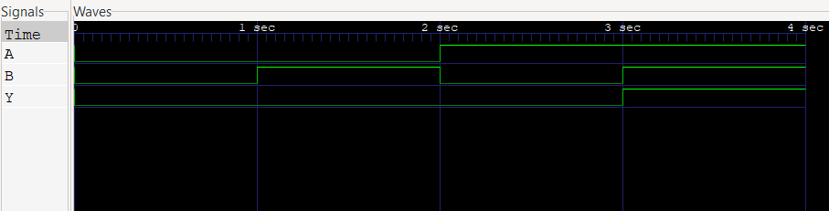

# **And Gate**

Modelling using Verilog

---

# Introduction

The AND gate is a primary logic gate where the output is equal to the product of its inputs. The output of this gate is high only if both the inputs are high else the output is low. Here’s the logical representation of the AND gate.


---

### Truth Table

|A	|B	|Y(A and B)|
|---|:---:|-------:|
|0	|0	|0 |
|0	|1	|0 |
|1	|0	|0 |
|1	|1	|1 |

As we can see from the truth table the output of the *AND Gate* is only high of both the inputs are high.

***Expression from the table Y = A & B***

---

# Verilog code for AND gate using gate-level modeling

```verilog
module AND_GLM(output Y, input A, B);
    and(Y, A, B); 
endmodule
```
Here and is the operation performed on A, B, to get output Y.

---

# Verilog code for AND gate using data-flow modeling

```verilog
module AND_DFM(output Y, input A, B);
    assign Y = A & B; 
endmodule
```

Just like the and operation, the & logical operator performs a binary multiplication of the inputs we write.

---

Compared to gate-level modeling, dataflow modeling in Verilog is a higher level of abstraction. What this means is, you don’t really need to know the circuit design. That’s really helpful because gate-level modeling becomes very complicated for a complex circuit.

All you need to know is the boolean logic equation of the output of the circuit in terms of its inputs. We use continuous assignments in dataflow modeling in most of the designs. The continuous assignments are made using the keyword assign.

---

# Verilog code for AND gate using behavioral modeling

When our level of abstraction is behavioral level, then we use reg datatype in the output ports. The reg data object holds its value from one procedural assignment statement to the next and means it holds its value over simulation data cycles.

Using the always statement, a procedural statement in Verilog, we run the program sequentially. (A, B) is known as the sensitivity list or the trigger list. The sensitivity list includes all input signals used by the always block. It controls when the statements in the always block are to be evaluated. **@** is a part of the syntax, used before the sensitivity list. In Verilog, begin embarks and  end concludes any block which contains more than one statement in it.

---


> 💡 Note:
> Note that the always statement always @(Y, A) could be written as always @ *. * would mean that the code itself has to decide on the input signals of the sensitivity list.

<br>

The condition for AND gate is that if both the inputs are high, then the output is also high, else in every other condition that has to be low.  

---

Verilog code for behaviour modelling of *AND Gate*

```verilog
module AND_BM (output reg Y, input A, B);
always @ (A or B) begin
    if (A == 1'b1 & B == 1'b1) begin
        Y = 1'b1;
    end
    else 
        Y = 1'b0; 
end
endmodule
```

---

# RTL Schematic of AND Gate


---

# Testbench of the AND gate using Verilog

```verilog
`include "AND_BM.v"

/* This is a testbench for AND BM */

module AND_BM_tb;
reg A, B;
wire Y;

// instantiate the AND module
AND_BM and_bm (Y, A, B);

initial begin
    A = 0; B = 0;
    #1 A = 0; B = 1;
    #1 A = 1; B = 0;
    #1 A = 1; B = 1;
    #1;
end

initial begin
    $monitor ("%t | A = %d| B = %d| Y = %d", $time, A, B, Y);
    $dumpfile("dump.vcd");
    $dumpvars();
end
endmodule
```

---

# Terminal Output of *IVerilog*

```
@Aditya Poli ➜ behavioural iverilog -o and_bm_sim .\AND_BM_tb.v && vvp .\and_bm_sim && gtkwave .\dump.vcd
VCD info: dumpfile dump.vcd opened for output.
                   0 | A = 0| B = 0| Y = 0
                   1 | A = 0| B = 1| Y = 0
                   2 | A = 1| B = 0| Y = 0
                   3 | A = 1| B = 1| Y = 1

GTKWave Analyzer v3.3.108 (w)1999-2020 BSI

[0] start time.
[4] end time.
WM Destroy
```

---

# Simulation Waveform

using ***GTKWave***



---

# References

[1] [Technobyte](https://technobyte.org/verilog-and-gate/)

    📝 Note: All of the content is from the above website.

[2] [Slides using **Marp**](https://marp.app/)